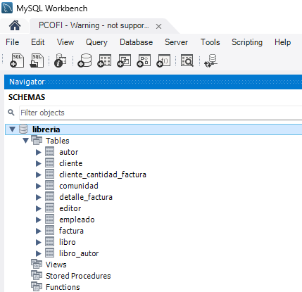

# Ejemplos Breves de ETL con Python, Pyspark y MySQL.

En este breve ensayo creamos una base de datos “libreria”, la cual consultaremos para realizar procedimientos de extracción, transformación y carga.

